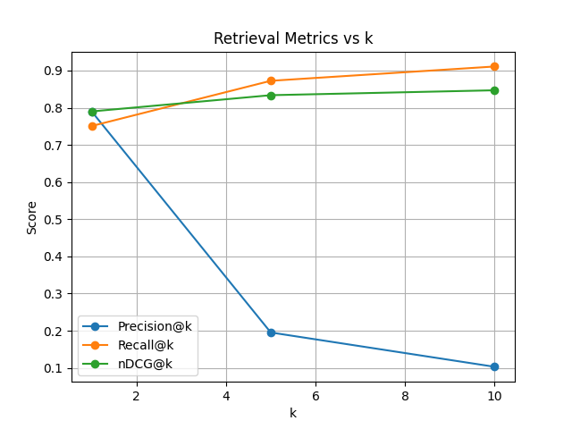

# RAG Retrieval Evaluation Harness

<p align="center">
  
  
  
</p>


A lightweight and reproducible evaluation harness for retrieval systems, especially Retrieval-Augmented Generation (RAG) pipelines.

It focuses on retrieval quality using standard Information Retrieval (IR) metrics:

- Precision@k
- Recall@k
- MRR@k (Mean Reciprocal Rank)
- nDCG@k (Normalized Discounted Cumulative Gain)

It supports evaluation at different granularities (**chunk-level** vs **document-level**), which is critical in real-world Retrieval-Augmented Generation (RAG) systems.

### Why this project?
RAG systems often regress silently when you change retrievers, chunking, or indexes.
This tool is meant to be a small, scriptable “regression test” for retrieval: run it before/after changes and see if your retriever actually got better or worse.

---

## Features

- BM25 baseline retriever
- Standard IR metrics (P@k, R@k, MRR@k, nDCG@k).
- Chunk-level vs Document-level evaluation.
- JSON output with per-query breakdown.
- Automatic metric plots (e.g. metric vs k).
- Modular retriever interface (easy to plug in custom retrievers).
- Unit tests.
- Real benchmark demo using BEIR (SciFact subset).

---

## Installation
Install locally in editable mode:
```bash
pip install -e .
```

For development (including tests):
```bash
pip install -e ".[dev]"
```

---

## Dataset Format

### Corpus (JSONL)
Each line must contain:

```json
{"doc_id": "d1", "text": "Document text", "metadata": {...}}
```

fields:
- `doc_id`: unique identifier.
- `text`: document or chunk text.
- `metadata` (optional): can include "parent_doc" when using chunked corpora.

### Queries (JSONL)
Each line must contain:

```json
{
  "query_id": "q1",
  "query": "Query text",
  "relevant_ids": ["d1"]
}
```

fields:
- `query_id`: unique identifier.
- `query`: query string.
- `relevant_ids`: list of relevant document IDs (doc-level or chunk-level).

---

## Quickstart (Synthetic Example)

Run evaluation:
```bash
python -m rag_eval.run \
  --corpus data/sample_corpus.jsonl \
  --queries data/sample_queries.jsonl \
  --plot report.png
```

This generates:
- results.json
- report.png

---

## Chunk-Level vs Document-Level Evaluation

In real RAG systems:
- Retrieval operates on chunks.
- Ground truth is often defined at document level (e.g. which paper is relevant).

This tool supports both evaluation modes:
```bash
# Chunk-level evaluation
python -m rag_eval.run \
  --corpus data/sample_corpus_chunked_v2.jsonl \
  --queries data/sample_queries_doc_gt_v2.jsonl \
  --eval-mode chunk

# Document-level evaluation
python -m rag_eval.run \
  --corpus data/sample_corpus_chunked_v2.jsonl \
  --queries data/sample_queries_doc_gt_v2.jsonl \
  --eval-mode doc
```

### Example behavior:
Chunk-level evaluation (ground truth is document-level):
- P@1 = 0.00
- All metrics ≈ 0.00

Document-level evaluation:
- P@1 = 1.00
- High recall and nDCG

This highlights how evaluation granularity can dramatically change reported metrics and lead to misleading conclusions if chosen incorrectly.

---

## Real Benchmark: BEIR (SciFact Subset)
Prepare a SciFact-based benchmark dataset:
```bash
pip install beir
python scripts/prepare_beir_scifact.py
```
This creates `data/beir_scifact_subset/`

Run evaluation:
```bash
python -m rag_eval.run \
  --corpus data/beir_scifact_subset/corpus.jsonl \
  --queries data/beir_scifact_subset/queries.jsonl \
  --plot report_beir.png
```

### Example metric curves generated by the evaluation harness (BM25 baseline, ~200 query subset):

<p align="left">
  
</p>

### Example results (BM25 baseline, ~200 query subset):

| k | Precision | Recall | MRR | nDCG |
| :--------: | :-------: | :-------: | :-------: | :-------: |
| 1  | 0.79 | 0.75 | 0.79 | 0.79 |
| 5 | 0.20 | 0.87 | 0.83 | 0.83 |
| 10 | 0.10 | 0.91 | 0.83 | 0.85 |

These are realistic values for a BM25 baseline on SciFact and help validate that the evaluation pipeline is implemented correctly.

## Output

The tool produces:
- `results.json` — aggregate metrics + per-query breakdown.
- `report.png` — metric curves vs k.

### Example JSON structure:
```json
{
  "aggregate": {
    "1": {
      "precision": 0.79,
      "recall": 0.75,
      "mrr": 0.79,
      "ndcg": 0.79
    }
  }
}
```

## Future Works
- Dense retriever integration (e.g. bi-encoders, E5, Contriever).
- Embedding caching
- Additional IR metrics (MAP, Recall@100, etc.).​
- Larger benchmark support (more BEIR tasks, custom datasets).